# Bloomerp

Bloomerp is an open-source Business Management Software framework that lets you create fully functional business management applications just by defining your Django database models.

It's out-of-the-box functionality gives you the ability to create advanced apps in minutes whilst maintaining the ability to add custom functionality without too much effort.

At its core, it leverages the popular Python framework Django and HTMX to provide robust and fast applications.

## Key features 🚀

Bloomerp comes packed with a variety of features:

- **Intuitive CRUD Views**: With integrated access control provided by Django.
- **Advanced List Views**: Offering powerful filtering capabilities.
- **PDF Generation System**: Easily define templates (like contracts) for your model objects.
- **Customizable Dashboards**: Based on SQL queries.
- **LLM Integration**: Create SQL queries using Large Language Models.
- **Bulk Uploads**: For efficiently importing data into models.
- **REST APIs**: Automatically generated for all models using Django REST Framework.
- **File System UI**: An intuitive interface including folder structures.
- **Bookmarking System**: Helps users track bookmarked objects.
- **Commenting System**: Allows you to comment on specific objects.

## Getting Started

You can start using the Bloomerp framework in a few simple steps:

1. **Install Django and Bloomerp**
2. **Set Up the Project**: Define settings in your Django application.
3. **Start Defining Your Models**
4. **Define custom views if necessary**

### Install Django and Bloomerp

First things first, let's install Django:

```sh
pip install django
```

Now, let's get Bloomerp installed:

```sh
pip install bloomerp
```

### Set Up the Project

Once you have the necessary dependencies installed, it's time to create your new project.

Imagine we're building a sales application that needs to track products, sales, and customers. We'll start by creating our Django project:

Create the Django project:

```sh
django-admin startproject core
```

Create the Django app:

```sh
django-admin startapp sales
```

After setting up the project and app, update `core/settings.py` to configure Bloomerp:

```python
# core/settings.py
from bloomerp.config import BLOOMERP_APPS, BLOOMERP_MIDDLEWARE, BLOOMERP_USER_MODEL

# Installed apps
INSTALLED_APPS = [
    # Default Django apps...
    'sales',  # Your sales app
    # Any other installed apps
]
INSTALLED_APPS += BLOOMERP_APPS

# Middleware
MIDDLEWARE = [
    # Default Django middleware...
]
MIDDLEWARE += BLOOMERP_MIDDLEWARE

# User model
AUTH_USER_MODEL = BLOOMERP_USER_MODEL

# Crispy Forms (used by Bloomerp)
CRISPY_ALLOWED_TEMPLATE_PACKS = "bootstrap5"
CRISPY_TEMPLATE_PACK = "bootstrap5"

# Bloomerp settings
BLOOMERP_SETTINGS = {
    "globals": {
        "organization_name": "FooBar",
    },
    "BASE_URL": "",  # The base URL of the application
    "ROUTERS": [
        # More on routers later; leave blank for now
    ],
    "OPENAI_API_KEY": "KEY",  # For LLM integration
}
```

With the settings configured, proceed to make migrations:

```sh
python manage.py migrate
```

### Create Your Models

Let's define some basic models for our sales application: `Customer`, `Product`, and `Order`.

```python
from django.db import models
from bloomerp.models import BloomerpModel
from bloomerp.models.fields import BloomerpFileField
from django.utils import timezone

class Customer(BloomerpModel):
    name = models.CharField(max_length=255)
    email = models.EmailField()
    phone = models.CharField(max_length=15)
    address = models.TextField()

    string_search_fields = ['name', 'email']  # Fields searchable via string queries
    allow_string_search = True  # Include in global search

class Product(BloomerpModel):
    name = models.CharField(max_length=255)
    description = models.TextField(blank=True, null=True)
    image = BloomerpFileField(allowed_extensions=['.jpg', '.jpeg', '.png'])
    price = models.DecimalField(max_digits=10, decimal_places=2)

    string_search_fields = ['name', 'description']
    allow_string_search = True

class Order(BloomerpModel):
    STATUS_CHOICES = (
        ('pending', 'Pending'),
        ('processing', 'Processing'),
        ('completed', 'Completed'),
        ('cancelled', 'Cancelled'),
    )
    date = models.DateField(default=timezone.now)
    product = models.ForeignKey(Product, on_delete=models.CASCADE)
    quantity = models.IntegerField()
    status = models.CharField(max_length=255, choices=STATUS_CHOICES, default='pending')

    string_search_fields = ['product__name', 'status']
    allow_string_search = True
```

**Notes:**

1. **Inherit from `BloomerpModel`**: This ensures compatibility with Bloomerp's features.
2. **`string_search_fields`**: Specifies fields for string-based searches (e.g., in the search bar or forms).
3. **`allow_string_search`**: Determines if the model is searchable via the global search bar.

Make migrations for your new models:

```sh
python manage.py makemigrations sales
python manage.py migrate sales
```

Every time you update your models, run:

```sh
python manage.py save_application_fields
```

Create a superuser to log in:

```sh
python manage.py createsuperuser
```

Start the server:

```sh
python manage.py runserver
```

### Overview of the Out-of-the-Box Application

Let's take a quick look at some of the base functionality provided by Bloomerp.

Note that all the provided features are neatly integrated with Django's permission system, and make use of HTMX for a nice single-page-application (SPA) feel.

#### Fully Customizable Dashboard

Create dashboards with charts, tables, links, custom texts, and more.

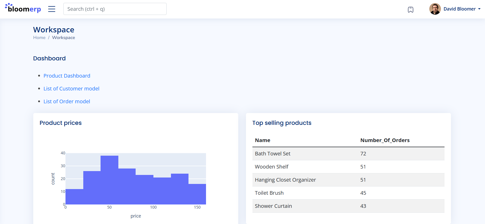

#### Create Objects

An intuitive and simple create view.

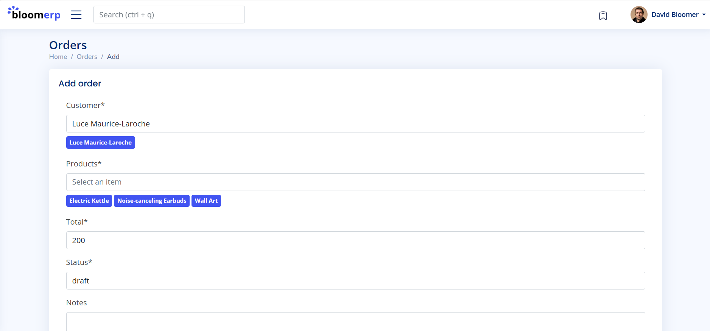

#### Detail views

Each object has an easy-to-use layout exposing different actions that can be performed on an object, such getting an overview, updating the objects, viewing files related to the object, and more.

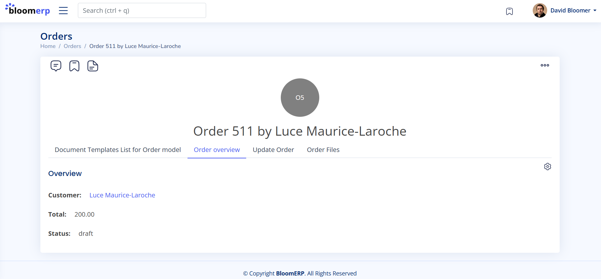

#### List views

Perform advanced queries on models. For example, filter orders **with a total between 200 and 300, including a specific product (Electric kettle).**

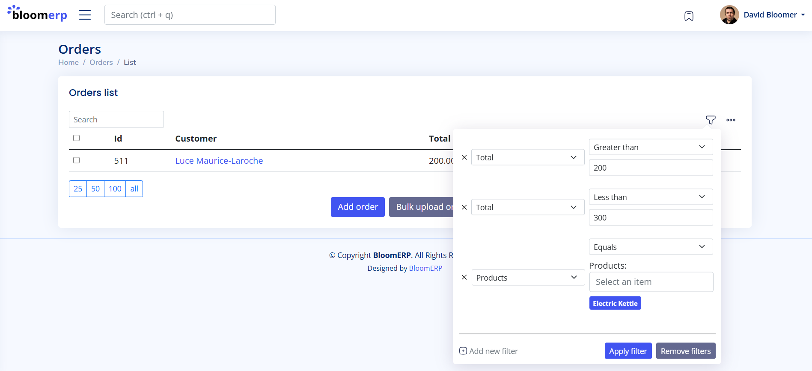

#### Creating PDFs via Document Templates

Generate standardized documents (like contracts) with dynamic data from your models.

*Creation of document template:*

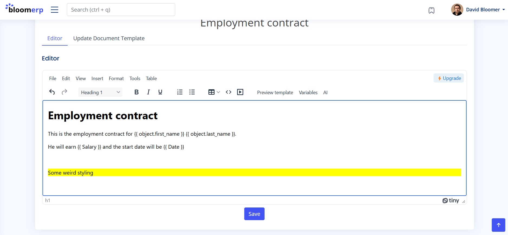

*Usage of template:*

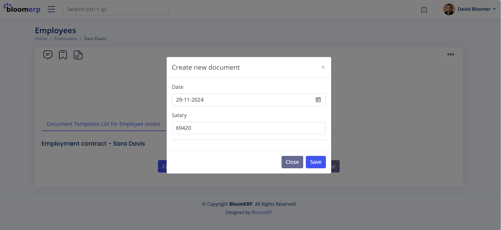

*PDF result:*

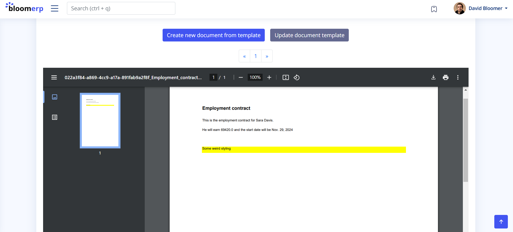

#### Intuitive Search Bar

Effortlessly navigate and find information using the powerful search bar. Supports searching for **specific objects**, **list-level routes (queries starting with `/`)** and **app-level routes (queries starting with `//`)**.

*Search all object containing "Ana" in their string-search fields:*


*Search for all list-level routes for the customer model (start query with `/`):*


*Search for all app-level routes starting with "cust" (start query with `//`)*

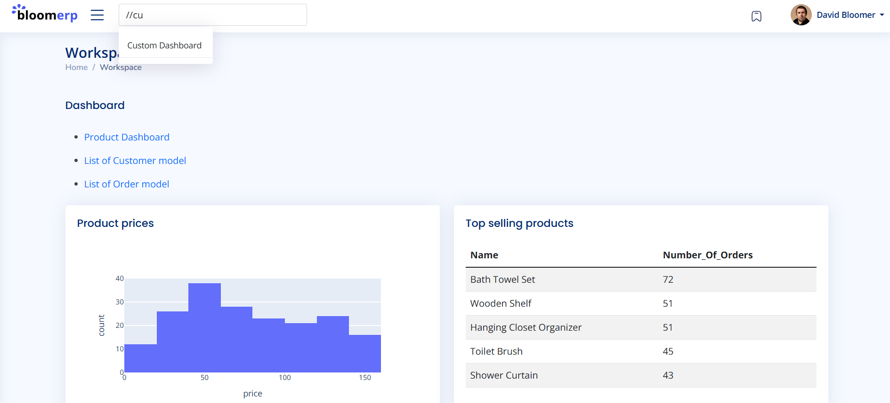


#### Additional Features

Bloomerp offers a range of other features. Documentation for these is coming soon. Stay tuned!

### Creating Custom Views Using Routers

One of the main goals of the Bloomerp framework is to empower developers to easily integrate custom functionality into the Bloomerp UI—beyond the out-of-the-box features—without requiring extensive setup.

Custom views can be created at three different levels:

1. **Detail-Level Routes**: Custom views defined for specific objects that fit inside the detail view layout. For example, an update view for a particular object. Routes follow the format: `www.example.com/model/object_id/route_name`

2. **List-Level Routes**: Custom views defined for a particular model but not tied to a specific object. For instance, the object list view we discussed earlier. Routes follow the format: `www.example.com/model/route_name`

3. **App-Level Routes**: Custom views that are not related to any model. These are useful for general application functionality. Routes follow the format: `www.example.com/route_name`

#### Getting Started

To begin building custom views, initialize the router in your `views.py` file and reference it in your `settings.py` file.

**In `views.py`:**

```python
# views.py
from bloomerp.utils.router import BloomerpRouter

router = BloomerpRouter()
```

**In `settings.py`:**

```python
# settings.py
BLOOMERP_SETTINGS = {
    "globals": {
        "organization_name": "FooBar",
    },
    "BASE_URL": "", 
    "ROUTERS": [
        'sales.views.router',  # Links to the router variable inside your app's views file
    ],
    "OPENAI_API_KEY": "KEY",  # For LLM integration
}
```

#### Example: Creating a Custom List-Level View

Let's create a custom list-level view that allows users to send emails to employees or customers.

**In `views.py`:**

```python
from django.shortcuts import render
from .models import Employee, Customer
from bloomerp.models import BloomerpModel
from bloomerp.views.mixins import HtmxMixin  # Important for UI integration
from django.views import View

@router.bloomerp_route(
    path='send-emails',  # Becomes /employees/send-emails & /customers/send-emails
    name='Send Emails',
    description='Send email to {model}',  # {model} is replaced with the model name
    route_type='list',
    url_name='send_emails',  # Becomes employees_send_emails & customers_send_emails
    models=[Employee, Customer],  # Models for which the route is created
)
class SendEmailsView(HtmxMixin, View):
    template_name = 'send_emails.html'
    model: BloomerpModel = None  # Passed via the router

    def get(self, request, *args, **kwargs):
        context = self.get_context_data()
        return render(request, self.template_name, context)

    def post(self, request, *args, **kwargs):
        context = self.get_context_data()

        # Business logic to send emails
        # ...

        return render(request, self.template_name, context)

    def get_context_data(self, **kwargs):
        context = super().get_context_data(**kwargs)
        # Retrieve objects from the model
        context['objects'] = self.model.objects.all()
        context['model'] = self.model
        return context
```

**Create the HTML template `send_emails.html`:**

Note: You don't need to extend the base template—the `HtmxMixin` handles that.

```html




<form method="post">
    
    <div class="mb-3">
        <label for="recipient" class="form-label">Select Recipient</label>
        <select class="form-select" name="recipient" id="recipient">
            
                <option value="{{ object.id }}">{{ object.name }}</option>
            
        </select>
    </div>

    <div class="mb-3">
        <label for="email_content" class="form-label">Email Content</label>
        <textarea class="form-control" name="email_content" id="email_content" rows="5"></textarea>
    </div>

    <button type="submit" class="btn btn-primary">Send</button>
</form>
```

This code will produce the following result:

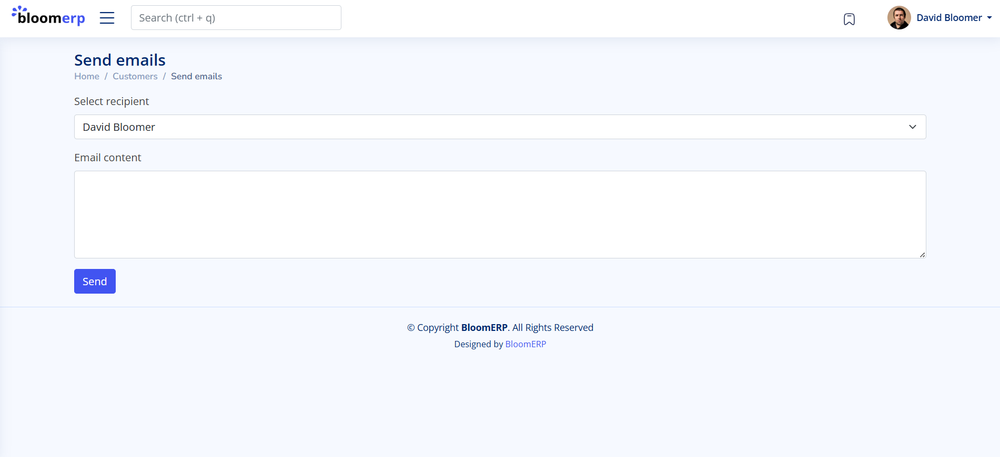

#### Example: Creating a Custom Detail-Level View

Suppose we want to send an email to a specific employee or customer without selecting them from a list. We can create a custom detail-level view for this.

In `views.py`:

```python
from bloomerp.views.detail import BloomerpBaseDetailView

@router.bloomerp_route(
    path='send-email',  # Becomes /employees/{pk}/send-email & /customers/{pk}/send-email
    name='Send Email',
    description='Send email to {object} of {model}',
    route_type='detail',
    url_name='send_email',  # Becomes employees_detail_send_email & customers_detail_send_email
    models=[Employee, Customer],
)
class SendEmailView(BloomerpBaseDetailView):
    template_name = 'send_email.html'
    model: BloomerpModel = None

    def post(self, request, *args, **kwargs):
        context = self.get_context_data()

        # Business logic to send the email
        # ...

        return render(request, self.template_name, context)
```

Create the HTML template `send_email.html`:

```html




<form method="post">
    
    <p>Send email to {{ object.name }}</p>

    <div class="mb-3">
        <label for="email_content" class="form-label">Email Content</label>
        <textarea class="form-control" name="email_content" id="email_content" rows="5"></textarea>
    </div>

    <button type="submit" class="btn btn-primary">Send</button>
</form>
```

Since we inherited from `BloomerpBaseDetailView`, all necessary context data (like `object`, `model`, and more) is already included.

This will produce the following result:

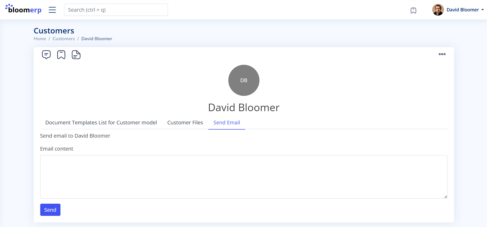

#### Example: Creating a Custom App-Level View

Finally, let's create a custom dashboard that's not linked to any particular model or object. We'll map this route to the endpoint `/custom-dashboard/`.

In `views.py`:

```python
@router.bloomerp_route(
    path='custom-dashboard',  # Becomes /custom-dashboard
    name='Custom Dashboard',
    description='A custom dashboard for the app',
    route_type='app',
    url_name='custom_dashboard',  # URL name becomes custom_dashboard
)
class CustomDashboardView(HtmxMixin, View):
    template_name = 'custom_dashboard.html'

    def get(self, request, *args, **kwargs):
        context = self.get_context_data()
        return render(request, self.template_name, context)

    def get_context_data(self, **kwargs):
        context = super().get_context_data(**kwargs)
        context['meaning_of_life'] = 42
        return context
```

Create the HTML template `custom_dashboard.html`:

```html




<p>Welcome to the custom dashboard!</p>

<p>The meaning of life is {{ meaning_of_life }}.</p>
```

This will produce the following result:

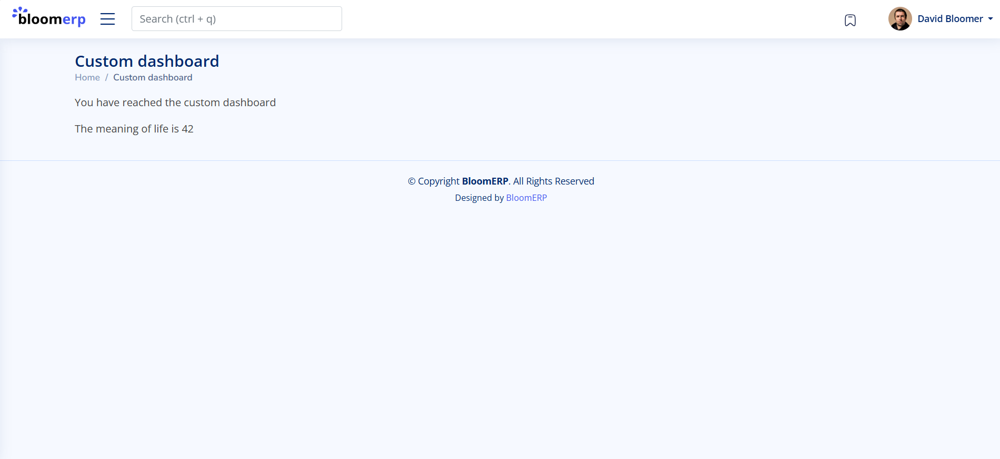

---

By following these examples, you can seamlessly integrate custom views into your Bloomerp application at various levels, enhancing functionality while maintaining a cohesive user interface.

## Found Errors? 🛑

If you encounter any bugs or issues, please let us know:

- **Open an Issue**: Report it on our GitHub issues page with details about the problem.
- **Contact Us**: Reach out directly via email or our community channels.

Your feedback helps us improve Bloomerp for everyone!

## Roadmap 🧭

We're currently at **version 0.1**, and we have big plans for the future. Here's what's coming up:

- **Integration of Notifications**: Real-time alerts and notifications within the app.
- **Continuous Bug Fixes**: Ongoing improvements to ensure stability and performance.
- **Enhanced Testing**: Writing more robust tests to cover the main functionality of the application.
- **Advanced LLM Integrations**: Expanding the use of Large Language Models for smarter features.
- **Docker Containerization**: Providing Docker support for easier deployment.
- **Scheduled Jobs**: Allowing users to schedule tasks and jobs within the application.
- **And More!**

Stay tuned for updates, and feel free to contribute to any of these upcoming features!

## Want to Contribute? 🤝

Each time I've referred to 'we' throughout this document, I'm actually only refering to myself (gotta stay professional). However I would love your help in making Bloomerp a **WE** project in the future 😉 ! Whether it's fixing bugs, adding new features, or improving documentation, your contributions are more than welcome.

- **Fork the Repository**: Start by forking the Bloomerp repository on GitHub.
- **Create a Branch**: Make a new branch for your feature or bug fix.
- **Submit a Pull Request**: When you're ready, submit a pull request for review.

Feel free to open issues for feature requests or discussions.